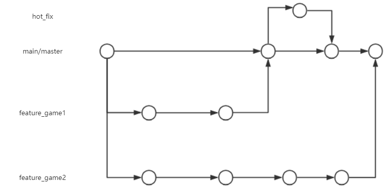
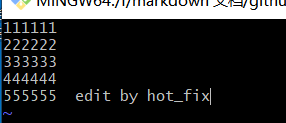
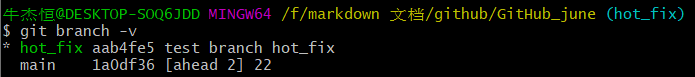
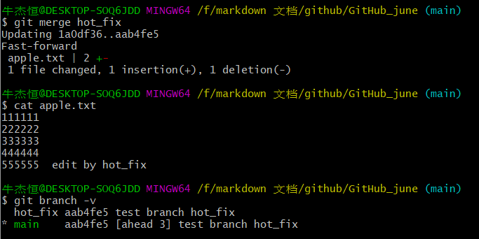
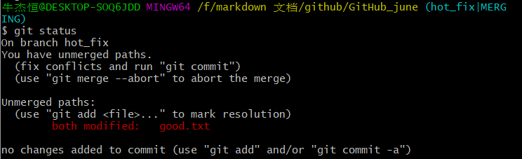
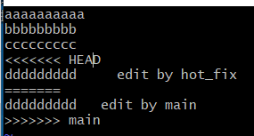
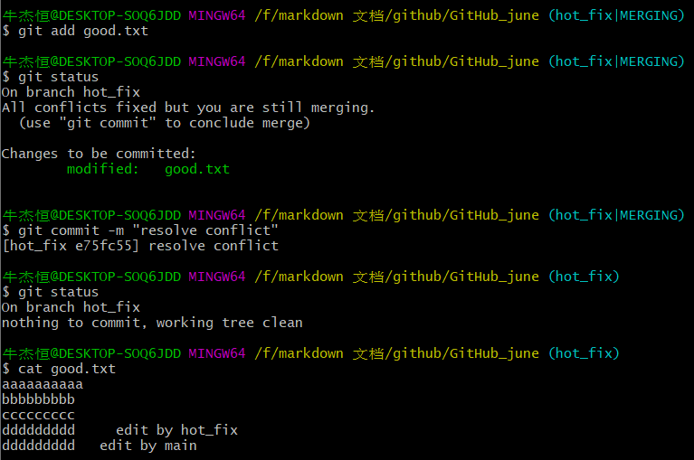
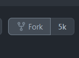
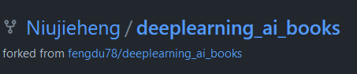

# Git

1.理解Fork、Pull Request、Merge Request    类比老师批卷子

2.理解分支 优点：同时并行推进，提高开发效率；某一分支开发失败，不会对其他分支有影响。

3.[分支的合并](https://git-scm.com/book/zh/v2/Git-%E5%88%86%E6%94%AF-%E5%88%86%E6%94%AF%E7%9A%84%E6%96%B0%E5%BB%BA%E4%B8%8E%E5%90%88%E5%B9%B6)

- 创建分支 git branch 分支名

- 查看分支 git branch -v

- 切换分支 git checkout 分支名

- 在另一分支上进行文件的修改

  

- 合并分支    

  ​     第一步：切换到接受修改的分支上。

​			第二步：执行merge命令

4.解决冲突 在本地库的冲突为例，类比提交远程时，冲突位置检查和修改的方式是一样的。

- 先修改main中的一个文件 提交本地库
- 再修改hot_fix的同一文件 提交本地库
- 在hot_fix下合并main (用merge)
- 查看冲突文件

- 冲突的表现 (错误转为手动合并 merging处于合并的状态)

​		head指向当前分支的内容

​		====到main是另一分支的内容

- 开始商讨处理冲突的地方

  第一步：编辑文件(vim)，删除特殊符号。

  第二步：把文件修改到满意的程度，保存退出

  第三步：git add 文件名

  第四步：git commit -m “日志信息”

5.Fork的合并

- fork按键，到自己的仓库。

- 再clone到本地 进行修改